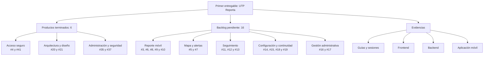

# UTP Reporta — Sistema móvil de gestión de incidentes

**Curso:** Integrador II  
**Proyecto:** UTP Reporta  
**Equipo:** Arnold Antezana Torres · Álvaro Alexis Capcha Hinostroza · Andrea Gallo Vargas · Richard Gómez Mandujano  
**Primer entregable:** viernes

## Objetivo

Elaborar un mapa que permita organizar los productos del primer entregable, tomando como referencia los formatos trabajados en las guías de laboratorio.

## Problema

La comunidad universitaria necesita un medio rápido, seguro y accesible para comunicar incidentes. **UTP Reporta** busca centralizar el registro, la ubicación, las evidencias y el seguimiento de cada reporte, facilitando además la atención por parte del personal de seguridad y de los administradores.

## Sprint del primer entregable

El tablero contiene **22 historias o tareas**: **6 terminadas** y **16 pendientes**.



## Productos terminados

| N.° | Producto del entregable | Issue | Estado |
|---:|---|:---:|:---:|
| 1 | Registro e inicio de sesión seguro | [#4](https://github.com/ErickATE1306/UTP-Report_app/issues/4) | ✅ Terminado |
| 2 | Establecer arquitectura para backend y frontend | [#21](https://github.com/ErickATE1306/UTP-Report_app/issues/21) | ✅ Terminado |
| 3 | Crear módulo del superadministrador en el frontend | [#35](https://github.com/ErickATE1306/UTP-Report_app/issues/35) | ✅ Terminado |
| 4 | Establecer diseños iniciales | [#20](https://github.com/ErickATE1306/UTP-Report_app/issues/20) | ✅ Terminado |
| 5 | Gestión de reportes asignados para Seguridad | [#37](https://github.com/ErickATE1306/UTP-Report_app/issues/37) | ✅ Terminado |
| 6 | Inicio de sesión seguro en la aplicación móvil | [#41](https://github.com/ErickATE1306/UTP-Report_app/issues/41) | ✅ Terminado |

## Backlog pendiente

| N.° | Historia o funcionalidad | Issue | Estado |
|---:|---|:---:|:---:|
| 1 | Reporte anónimo de incidentes desde el móvil | [#3](https://github.com/ErickATE1306/UTP-Report_app/issues/3) | ⬜ Pendiente |
| 2 | Alertas geolocalizadas mediante notificaciones push | [#5](https://github.com/ErickATE1306/UTP-Report_app/issues/5) | ⬜ Pendiente |
| 3 | Botón SOS de acceso rápido | [#6](https://github.com/ErickATE1306/UTP-Report_app/issues/6) | ⬜ Pendiente |
| 4 | Mapa móvil de incidentes y zonas de riesgo | [#7](https://github.com/ErickATE1306/UTP-Report_app/issues/7) | ⬜ Pendiente |
| 5 | Reporte con ubicación automática | [#8](https://github.com/ErickATE1306/UTP-Report_app/issues/8) | ⬜ Pendiente |
| 6 | Evidencias desde cámara o galería | [#9](https://github.com/ErickATE1306/UTP-Report_app/issues/9) | ⬜ Pendiente |
| 7 | Registro de reportes mediante pasos guiados | [#10](https://github.com/ErickATE1306/UTP-Report_app/issues/10) | ⬜ Pendiente |
| 8 | Confirmación y seguimiento del reporte | [#11](https://github.com/ErickATE1306/UTP-Report_app/issues/11) | ⬜ Pendiente |
| 9 | Historial de reportes del usuario | [#12](https://github.com/ErickATE1306/UTP-Report_app/issues/12) | ⬜ Pendiente |
| 10 | Centro de notificaciones | [#13](https://github.com/ErickATE1306/UTP-Report_app/issues/13) | ⬜ Pendiente |
| 11 | Configuración de permisos y preferencias | [#14](https://github.com/ErickATE1306/UTP-Report_app/issues/14) | ⬜ Pendiente |
| 12 | Recuperación ante pérdida de conexión | [#15](https://github.com/ErickATE1306/UTP-Report_app/issues/15) | ⬜ Pendiente |
| 13 | Gestión móvil de reportes para administrador | [#16](https://github.com/ErickATE1306/UTP-Report_app/issues/16) | ⬜ Pendiente |
| 14 | Filtros y búsqueda de reportes | [#17](https://github.com/ErickATE1306/UTP-Report_app/issues/17) | ⬜ Pendiente |
| 15 | Experiencia móvil accesible | [#18](https://github.com/ErickATE1306/UTP-Report_app/issues/18) | ⬜ Pendiente |
| 16 | Uso eficiente de ubicación y batería | [#19](https://github.com/ErickATE1306/UTP-Report_app/issues/19) | ⬜ Pendiente |

## Evidencias del primer entregable

| Producto | Ubicación |
|---|---|
| Evidencia del Laboratorio 02 | [Ver evidencia](Laboratorio02/sesion02.jpeg) |
| Evidencias individuales de la Sesión 02 | [Arnold](Sesion02/Antezana%20Torres%20Arnold/sesion02.jpeg) · [Álvaro](Sesion02/Capcha%20Hinostroza%20Alvaro%20Alexis/Semana2.jpg) · [Andrea](Sesion02/Gallo%20Vargas%20Andrea/Sesion2.jpg) · [Richard](Sesion02/Gomez%20Mandujano%20Richard/Semana02.jpeg) |
| Requisitos funcionales y no funcionales — Sesión 03 | [Arnold](Sesion03/Antezana%20Torres%20Arnold/RF-RNF.jpeg) · [Richard](Sesion03/Gomez%20Mandujano%20Richard/semana3.jpeg) |
| Scrum y gestión tradicional — Sesión 04 | [Arnold](Sesion04/Antezana%20Torres%20Arnold/Scum_Tradicional.jpeg) · [Richard](Sesion04/Gomez%20Mandujano%20Richard/semana4.jpeg) |
| Frontend web | [`UTP+Report_copy/front`](UTP+Report_copy/front) |
| Backend y API | [`UTP+Report_copy/utp-reporta-backend`](UTP+Report_copy/utp-reporta-backend) |
| Arquitectura del backend | [Ver documentación](UTP+Report_copy/utp-reporta-backend/ARCHITECTURE.md) |
| Aplicación móvil/multiplataforma | [`UTPReportApp`](UTPReportApp) |

## Estructura del repositorio

```text
UTP-Report_app/
├── Laboratorio02/                  # Evidencia grupal
├── Sesion02/                       # Evidencias sobre Scrum
├── Sesion03/                       # Requisitos funcionales y no funcionales
├── Sesion04/                       # Scrum y gestión tradicional
├── UTP+Report_copy/
│   ├── front/                      # Frontend Angular
│   └── utp-reporta-backend/        # Backend Spring Boot
└── UTPReportApp/                   # Aplicación Kotlin Multiplatform
```

## Tecnologías

- **Frontend web:** Angular, TypeScript y SCSS.
- **Backend:** Java, Spring Boot, Spring Security y JWT.
- **Base de datos:** MySQL.
- **Aplicación móvil:** Kotlin Multiplatform y Compose Multiplatform.
- **Documentación de API:** OpenAPI y Swagger UI.

## Verificación antes de presentar

- [x] Los seis productos terminados están identificados.
- [x] Los dieciséis ítems pendientes están registrados.
- [x] Las evidencias están organizadas por laboratorio y sesión.
- [ ] Confirmar responsables y fechas en el tablero del sprint.
- [ ] Verificar que todos los enlaces funcionen desde GitHub.
- [ ] Probar el inicio de sesión web y móvil.
- [ ] Probar la gestión de reportes asignados.
- [ ] Preparar una demostración breve de arquitectura, diseño y funcionalidades.

---

**Avance del tablero:** 6 de 22 ítems terminados (27 %).
